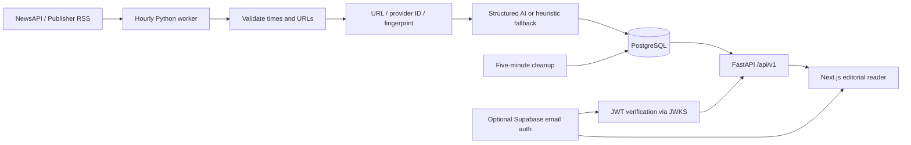

# Architecture

The backend separates API contracts, persistence models, repositories, provider interfaces, processing, and worker entry points. SQLite uses the same schema for local development. Alembic owns schema creation. NewsAPI and optional AI access only run server-side.

Primary category describes the topic; additional topic relations and geography remain separate. Tamilnadu and India browsing also match geography, while World matches global scope. Queries return distinct article rows and stable timestamp/ID ordering. Feed/search/detail/bookmark/source queries exclude expired articles immediately. API results are not cached, so cleanup delays cannot expose expired database rows; a page already open in a browser is a snapshot and must refresh to observe changes.

Articles contain source attribution, URL normalization, source excerpt, optional summary, image reference, taxonomy, estimated confidence, processing provenance, hashes, and four UTC timestamps. Full article bodies and image binaries are not stored. Fingerprints combine source, exact headline, and publication timestamp; similar headlines are never used to cluster distinct reports. Existing URL/provider records are skipped without reprocessing; correction updates at an existing URL are a future enhancement. AI results can be reused for exact content hashes while active; changing the processing version invalidates this cache. Related-coverage clustering and semantic search are separate future features.

Retention is `published_at + 4 days`, not four days from fetch. Missing, timezone-free, future, and already-expired publication timestamps are rejected, counted as skipped, and never made to appear fresh. Physical deletion cascades to topic joins and bookmarks; bookmarks retain no expired excerpts. Ingestion metadata retains counts/errors for 30 days. Sources/taxonomy remain reusable metadata. Backups and external provider copies have separate retention policies.

Public search uses PostgreSQL `simple` full-text token matching (including a GIN expression index), and SQLite token conjunction for local verification. Filters include category, topic, region, language, source, and UTC date boundaries. Page sizes are bounded to 50. Authentication protects account actions; operational tools require a server-only token. Rate limiting is per process/IP, suitable for local evaluation; multiple instances require shared rate-limit storage and trusted proxy configuration.

Storage sizing: `daily articles x 4 x average row size`, plus indexes and database overhead. At 5,000 articles/day and roughly 5 KB of permitted text/metadata per article, retained rows are about 100 MB before indexes/overhead. This is an estimate to measure with real provider data. Avoiding full bodies, PDFs, and downloaded media is the largest storage saving. PostgreSQL deletion makes space reusable; allocated database files may not shrink immediately. Autovacuum and monitoring are required for sustained workloads.
